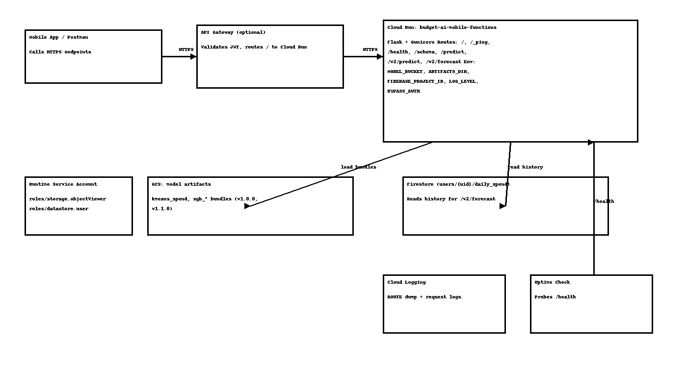
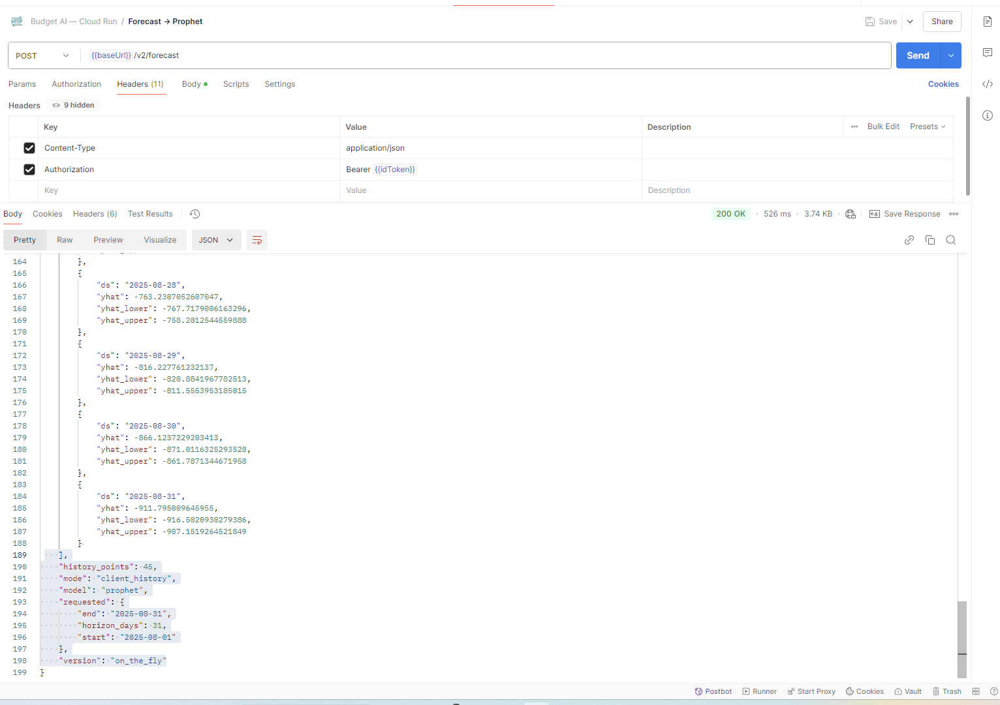
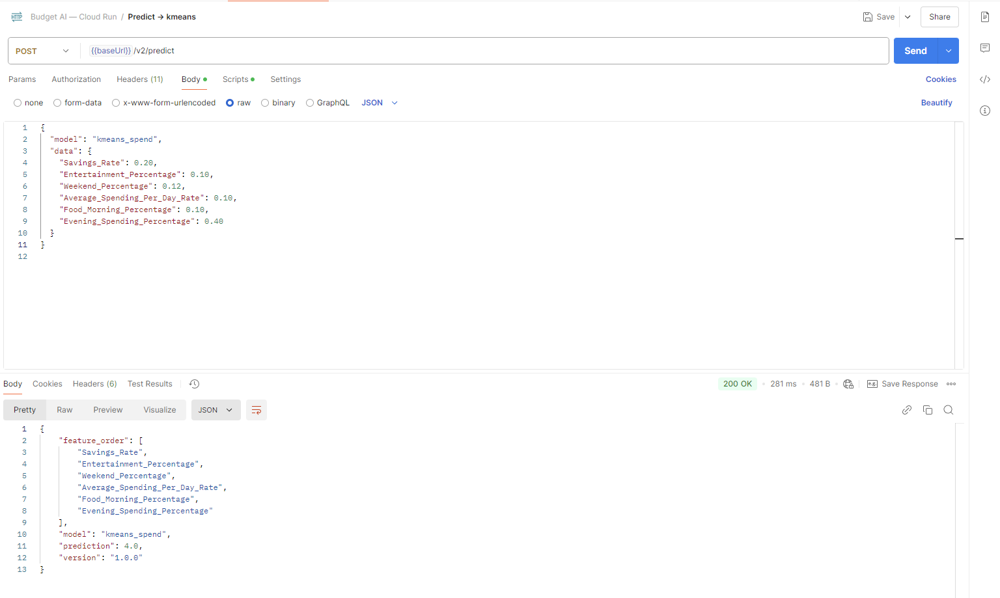
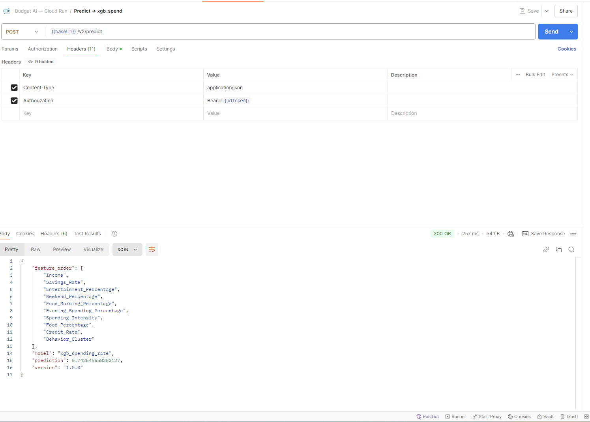
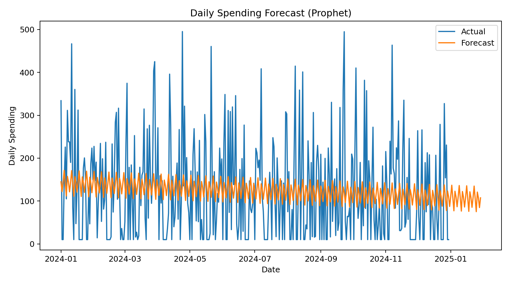
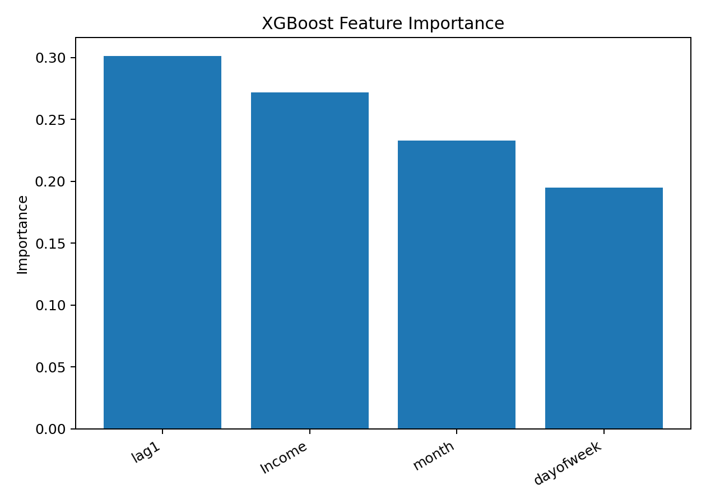
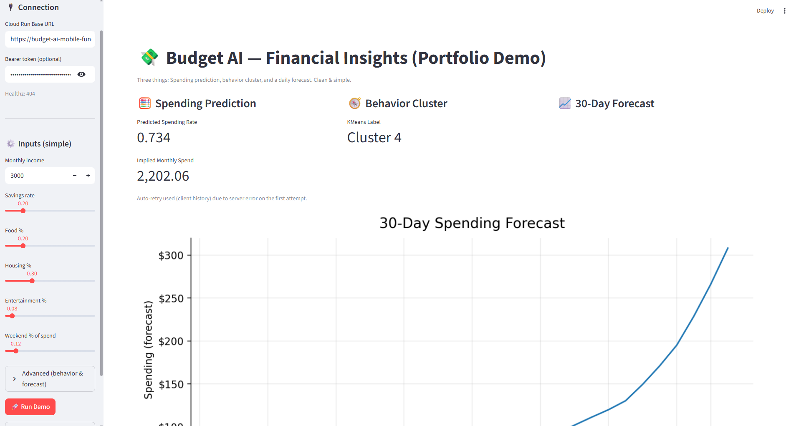

# Budget-AI — ML + API Showcase

🚀 End-to-end machine learning backend for personal finance:
- **Prophet** for short-horizon forecasts  
- **XGBoost** for regression on spending/savings rates  
- **KMeans** for behavior clustering  
- Clean **/schema**, **/v2/predict**, **/v2/forecast** endpoints  
- Deployed on **Google Cloud Run**, secured with Firebase Auth  

---

## 🔎 What to Review (Portfolio Highlights)

If you’re skimming, start here:

1. **Architecture** → [docs/architecture.png](docs/architecture.png)
   

2. **API Examples** → [docs/API.md](docs/API.md)  
   - `GET /health`, `GET /schema`  
   - `POST /v2/predict` (XGB + KMeans)  
   - `POST /v2/forecast` (Prophet)

      📸 Live Postman Runs:  
   - Forecast (Prophet) →   
   - Predict (KMeans cluster) →   
   - Predict (XGB spending rate) → 

3. **Screenshots** (see `docs/`)  
   - Forecast plot →   
   - Feature importance →   
   - Demo dashboard → 

4. **Reproducible Training** → [`training/train_all.py`](training/train_all.py)  
   One-command pipeline builds all models from synthetic/public demo data.

---

## 🏋️ Training Pipeline

All models (KMeans + XGB regressors + stacked classifier) are reproducible with a single command:

```bash
# from project root
python -m training.train_all

# or
python training/train_all.py
This script will:

Load the training data (synthetic_data_synth_real_combined.csv under training/data by default).

Train KMeans (kmeans_spend) on clustering-variant features.

Save stable cluster IDs + human-readable labels.

Derive XGB features and inject Behavior_Cluster from the trained KMeans.

Train XGB regressors:

xgb_spending_rate

xgb_saving_rate

xgb_entertainment_percentage

xgb_housing_rate

xgb_credit_rate

xgb_health_rate

xgb_food_percentage

Train XGB stacked classifier (xgb_savings_goal) using OOF (out-of-fold) predictions from the regressors for leakage-safe meta-features.

📦 Artifacts
Each model is saved under:

artifacts/<model_name>/v<version>/
    ├── model.joblib      # sklearn pipeline (preprocessor + estimator)
    └── metadata.json     # rich metadata (schema, metrics, provenance)
Example:


artifacts/xgb_spending_rate/v1.0.0/
    ├── model.joblib
    └── metadata.json
📑 Metadata
Every metadata.json contains:

name, version, created_at

feature_names (strict order for serving)

artifact_hash_sha256 (integrity check)

sklearn_version, xgboost_version, python_version

Extras:

Regressors → target, cv_rmse_mean, cv_rmse_std, value_range, kmeans_source

KMeans → cluster_id_map, cluster_labels, n_clusters

Classifier → dependencies (submodel graph), kmeans_source, decision_threshold, auc, acc

📜 Schema File
After training, generate a consolidated schema file for documentation and serving parity:

python tools/generate_feature_specs.py
Output:

schema/feature_specs.json
This lists each model’s exact feature_names, value_range, and dependencies — excellent for API docs and CI checks.

🔄 Reproducible Training
One-command training


python -m training.train_all
Outputs

artifacts/<model_name>/v<MODEL_VERSION>/{model.joblib, metadata.json}
schema/feature_specs.json
Versioning

export MODEL_VERSION=$(date +'%Y%m%d%H%M%S')   # or "1.2.0"
python -m training.train_all
🌐 API Versions
/predict (v1): legacy, array-based input, no schema enforcement.

/v2/predict: strict feature schemas, orchestrated OOF_* meta-features, portfolio-ready.

🔧 Environment Variables

# where local artifacts live inside the container
export ARTIFACTS_DIR=/app/artifacts

# pin versions (or omit to take latest local)
export VER_KMEANS=1.0.0
export VER_XGB_SPEND=1.0.0
export VER_XGB_SAVE=1.0.0
export VER_XGB_ENT=1.0.0
export VER_XGB_HOUS=1.0.0
export VER_XGB_CRED=1.0.0
export VER_XGB_HEALTH=1.0.0
export VER_XGB_FOOD=1.0.0
export VER_XGB_GOAL=1.0.0
export VER_PROPHET=1.0.0

# optional GCS pull if a pinned version isn't found locally
export MODEL_BUCKET=my-ml-artifacts
export MODEL_PREFIX=budget-ai   # optional path prefix inside bucket
export GOOGLE_APPLICATION_CREDENTIALS=/app/service-account.json
🔑 Authentication
All requests include the Firebase ID token:


final token = await _authService.getIdentityToken();
🔮 Predictions (v2)
Use _postV2 or the convenience helpers:


final data = {
  'Income': 3000,
  'Savings_Rate': 0.22,
  'Entertainment_Percentage': 0.08,
  'Weekend_Percentage': 0.03,
  'Average_Spending_Per_Day_Rate': 0.025,
  'Food_Morning_Percentage': 0.01,
  'Evening_Spending_Percentage': 0.015,
  'Spending_Intensity': 0.07,
  'Food_Percentage': 0.12,
  'Credit_Rate': 0.10,
  'Housing_Rate': 0.28,
  // Behavior_Cluster omitted — server computes via KMeans internally
};

final spending = await predictionService.predictSpendingRateV2like(data);
final savings  = await predictionService.predictSavingsGoalV2like(data);

// Or for any new model:
final res = await predictionService.predictAny('xgb_health_rate', data);
📈 Forecasting (v2 Prophet)
dart
Copy code
final forecast = await predictionService.forecastSmart(
  start: DateTime(2025, 8, 1),
  end: DateTime(2025, 8, 31),
);
The server will return daily forecast values within the requested range.

🛡️ Smart Router (senior polish)
Client prefers v2 by default.

If v2 returns rollout/compatibility errors (404/405/422/500s), it falls back to v1 automatically.

Ensures production apps stay resilient during deployment transitions.


final result = await predictionService.predictSmart('xgb_spending_rate', data);
🔒 Security & Access
API protected with Firebase Authentication (ID tokens).

Model artifacts stored in private GCS.

Cloud Run pulls models using Application Default Credentials for the runtime service account with roles/storage.objectViewer.

No static keys; no public access to model files.

Versioned model registry:

gs://<bucket>/<model_name>/vX.Y.Z/{model.joblib,metadata.json}